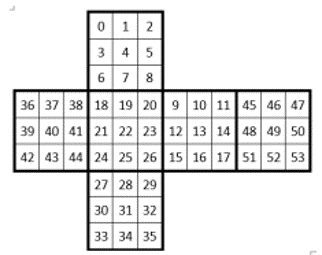

# Rubiks_Cube_Solver_robot
My first robot which is solving the Rubiks_Cube with Dynamixel_servo_motor.

# Rubiks Cube Solver Ver. 1.0 (RCSv1)
임베디드장비(Raspberry Pi 4 B+)와 영상처리(큐브 인식), Dynamixel 제어를 스스로 공부해보고 활용해 큐브를 자동으로 맞춰주는 로봇을 만들었다.

* **제작자 : 정우진(Woo)**
* **제작 기간 : 22.02.28~22.05.15**
* **보고서 작성 일 : 22.05.25**

## 요약

22년 5월 15일 최종적으로 1차 제작 완료한 모델로,
무작위로 섞은 큐브를 PiCam으로 인식하고, Dynamixel을 사용해 큐브를 푸는 로봇이다. 

큐브를 인식하고 푸는 시간은 총 3분 10초에서 3분 30초가 걸린다.   
빠른 로봇은 아니고, 이미 만들어진 제품을 참고한 작품이지만 스스로 배우고 학습하기에 적합한 활동이었다.  
이후 동아리 후배들이 작품을 봤을 때 자극을 받아 더 발전할 것이다.   
추후에는 더 발전시켜 완성도를 높일 것이다.

위 영상은 작동과정을 보여주고 있는 영상으로, 2배속을 한 영상이다. (임시로 넣은 영상임)

### 개발 동기

필자는 임베디드 시스템을 한번도 경험해 보지 못했다. 이번 기회에 Raspberry Pi에 익숙해지고 경험을 쌓기로 했다.    
또한 모터 제어하는 방법을 잘 알지 못해 눈으로 로봇이 작동하는 것을 확인할 수 있으며 재미를 갖을 수 있는 요소를 찾다가   
'큐브 자동으로 맞춰주는 로봇'을 알게 되었다.    

또한 국민대 자율주행 자동차 대회 참가를 통해 처음 알게 된 image processing 기술을(본선진출) 좀더 이해하고 발전시켜 나가보기로 했다.   

따라서 다음과 같은 이유로 Cube solver을 제작하기로 했다. 

### 개발 목표

1) Picamera를 사용해 Cube 색깔 인식 알고리즘 구현   
2) 주어진 부품(Servo motor : Dynamixel)에 맞출 수 있는 로봇 하드웨어 modeling   
3) Dynamixel SDK를 참고해 모터 동작 알고리즘 구현   
4) 구현한 알고리즘과 하드웨어 결합으로 로봇 만들기   
5) LCD화면 및 스위치 장착   

## 작품 구성

로봇이 어떻게 구성되어 있는지 사진과 설명을 적는다. 또한 각 부품들이 어떤 역할을 하는지 설명한다.

### 작품 전체 사진

전체적인 작품 사진을 찍고 설명한다.

(시간 문제로 case부분 3d모델링을 하지 못해 임시적으로 사진을 다음과 같이 첨부했습니다.)

사용된 servo motor은 총 3개로 Robotis사의 Dynamixel XM430-W350-T모델을 사용했다.   
사용된 위치는 (1), (2), (3)이다.    

지면과 수평인 부분을 x축, 사진을 바라보고 있는 방향을 y축, 지면과 수직인 방향이 z축이라고 가정할 때,   
지면과 평면(xy축 평면)인 부분으로 회전시켜 주기 위해서 (1)번이 동작해야 하고,   
지면과 수직(yz축 평면)인 부분으로 회전시켜 주기 위해서는 (2)번이 동작해야 한다.   
큐브 면을 회전시키기 위해서는 큐브를 (3)모터로 고정시킨뒤 (1)번 모터를 동작시킨다.   

아래 사진은 2번 모터에서 shift가 동작해 큐브를 뒤집어 주는 모습이다.   

(4)번은 큐브면을 인식시켜 (color detect) 큐브 맞추는 solution을 제공하기 위해서 Rpi camera를 설치하였다.   
(5)번은 전체적으로 cube solver robot을 축소화 시키면서 발생한 부분이며, (1)번 모터를 고정시키기 위해서 필요한 motor holder이다.   
(6)번은 아직 case 완성품을 만들기 전이며, 외부 회로와 Raspberry pi를 보관하기 위한 case이다.   
motor를 크고 키기 위한 U2D2와 스위치는 보이는 곳에 두었다.   

* 동작 원리

전체적인 동작 원리는   
-> (6)번의 LCD화면을 통해 부팅이 성공적인지 확인 후, 스위치를 눌러 시작   
-> (4)번의 camera를 통해 cube의 6면의 색깔을 모두 인식 (이때 (1), (2), (3), 모터를 모두 사용해 큐브를 인식하기 위해 모터를 동작시킨다.)   
-> 인식된 색깔을 통해 cube solution을 계산하고 (1), (2), (3) 모터를 통해 큐브를 맞추기.   
-> 큐브를 모두 맞춘 경우, LCD화면에 성공 글자를 출력시키고, 다시 초기 상태로 복귀한다. 

### 사용한 부품

로봇을 만드는데 사용한 부품에 대해 적는다.
|Raspberry Pi 4 Model B 4GB | Raspberry Pi Camera V2 | Dynamixel XM430-W350-T | U2D2 | GANCUBE | 
|--|--|--|--|--|
||||||

### 모델 parts
로봇을 만들기 위한 3D모델링에 대한 설명이다. 
아래 사진은 모델링을 하기 위해 참고한 모델들이다. 

|1번|2번|3번|
|--|--|--|
||||

하지만 아래 사진 처럼 주어진 모델이 사용하고자 하는 servo motor에 맞지 않았다. 

|1번|2번|3번|
|---|---|---|
||||
|기본 모델이 servo motor 크기와 부합. |Lifter 부분이 motor과 다른 설계로 cube를 뒤집지 못함. | motor을 holder 부분이 없어 부품 조립에 문제. |

3D 모델링으로 모든 모델링을 수정하고 제작해 다음과 같은 모델을 만들 수 있게 되었다. 

|3d model|출력 및 조립|
|---|---|
|||

## 작동 알고리즘

로봇이 큐브를 인식하기 부터 풀기까지 모든 동작의 알고리즘에 대해 설명한다. 

### 배경지식

해당 로봇과 관련된 선행 조사에 대해 작성한다.
사용한 큐브   

|western_cube|cube_table|
|--|--|
|||

 큐브 설명하기
|큐브 돌릴때 사용하는 명칭| 큐브 맞추는 방법 알고리즘|
|--|--|
|||

 Raspberry Pi의 GPIO

   

### 사용한 기술

일을 수행하기 위한 사용한 알고리즘 및 기법에 대해 작성한다.

1. OpenCV, cube face contour detect

   

2. color recognize using HSV

   

3. Dynamixel SDK

## 개발 과정

개발하면서 크게 어려웠던 점을 순서대로 나열하고 해결방법은 아래에 작성한다.

### 하드웨어 개발 과정

### 소프트웨어 개발 과정

#### 영상처리

#### 모터제어

## 추후 목표

## 결론

